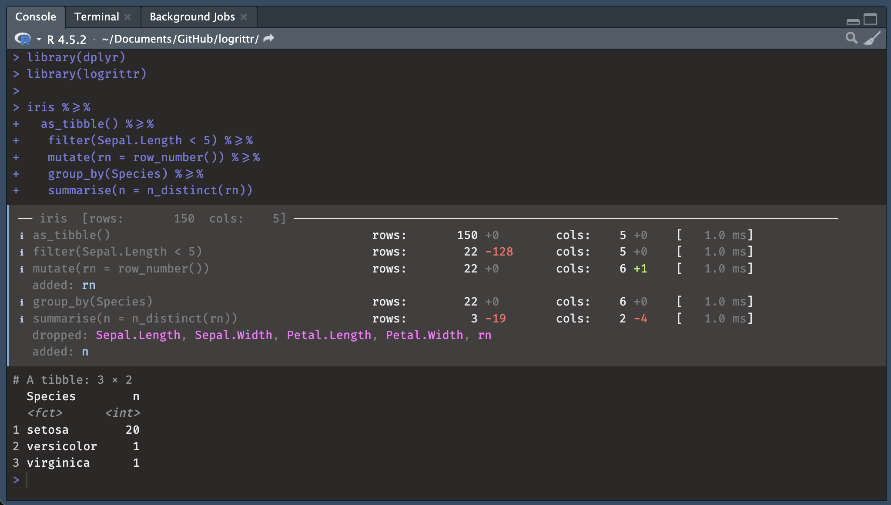
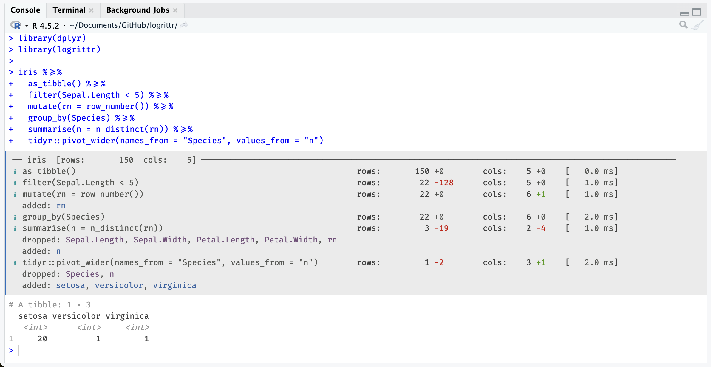

# logrittr 

> A logging pipe operator for dplyr and tidyverse data pipelines.

> dplyr's verbs are descriptive: let's make them more verbose!




## Motivation


In SAS, every DATA step prints a log:

```
NOTE: There were 120000 observations read from WORK.SALES.
NOTE: 7153 observations were deleted.
NOTE: The data set WORK.RESULT has 112847 observations and 11 variables.
```


R's `dplyr` pipelines are silent. `logrittr` fills that gap with `%>=%`, a
drop-in pipe that logs row counts, column counts, added/dropped columns, and
timing at every step, with no function masking.

With [Fira Code](https://github.com/tonsky/FiraCode) ligatures, `%>=%` renders
as a single wide arrow visually similar to `%>% with an added subline like a subtitle (sub-log).


## Multiples contexts

Things happens:

```
NOTE: There were 120000 observations read from WORK.SALES.
NOTE: 120000 observations were deleted.
NOTE: The data set WORK.RESULT has 0 observations and 11 variables.
```

#### Pro

Reading this long after execution of a script helps you see:

- what happened at which data step without the need of running code again
- keep trace of important workflows
- guarantee that you are able to explain what happened (auditing for instance)

In professional contexts it's often needed.

#### Educational

This will also make more sense with a logging output for people with few background in 
the tidyverse: first hours of code following a tutorial or learning alone.

## Installation

```r
# from github
devtools::install_github("GuillaumePressiat/logrittr")
```

## Usage

```r
library(logrittr)
library(dplyr)

iris %>=%
  as_tibble() %>=%
  filter(Sepal.Length < 5)  %>=%
  mutate(rn = row_number()) %>=%
  semi_join(
    iris %>% as_tibble() %>=%
      filter(Species == "setosa"),
    by = "Species"
  )  %>=%
  group_by(Species) %>=%
  summarise(n = n_distinct(rn))
```

```
ℹ as_tibble()                                  rows:       150 +0        cols:    5 +0    [   0.0 ms]
ℹ filter(Sepal.Length < 5)                     rows:        22 -128      cols:    5 +0    [   1.0 ms]
ℹ mutate(rn = row_number())                    rows:        22 +0        cols:    6 +1    [   0.0 ms]
  added: rn
ℹ   > filter(Species == "setosa")              rows:        50 -100      cols:    5 +0    [   0.0 ms]
ℹ semi_join(iris %>% as_tibble() %>=%          rows:        20 -2        cols:    6 +0    [   5.0 ms]
  filter(Species == "setosa"), by = "Species")
ℹ group_by(Species)                            rows:        20 +0        cols:    6 +0    [   0.0 ms]
ℹ summarise(n = n_distinct(rn))                rows:         1 -19       cols:    2 -4    [   1.0 ms]
  dropped: Sepal.Length, Sepal.Width, Petal.Length, Petal.Width, rn
  added: n
```

### Screenshot



## Options

```r
# Switch to English, comma as thousands separator, wider labels
logrittr_options(lang = "en", big_mark = ",", wrap_width = 60)

# Back to defaults
logrittr_options(lang = "fr", big_mark = "\u00a0", wrap_width = 52)
```

| Option | Default | Description |
|---|---|---|
| `wrap_width` | `32` | Max chars before step label wraps |
| `big_mark` | `" "` (thin space) | Thousands separator |
| `lang` | `"en"` | Display language: `"fr"` or `"en"` |

## Why not `tidylog`?

`tidylog` is a really neat package that gives me motivation for this one.
`tidylog` works by masking dplyr functions which can cause subtle conflicts
with other packages. 

`logrittr` uses a custom pipe operator and never touches
the dplyr namespace.

## Limitations 

Like `tidylog`, logrittr only works with dplyr pipelines on R data.frames (in memory)
and is not able to do so with dbplyr pipelines from databases (remote/lazy table).

## Roadmap

- [ ] File sink for production pipelines
- [ ] `with_logging()` wrapper for `|>` compatibility
- [ ] `loglevel` option to mute sub-pipeline steps
