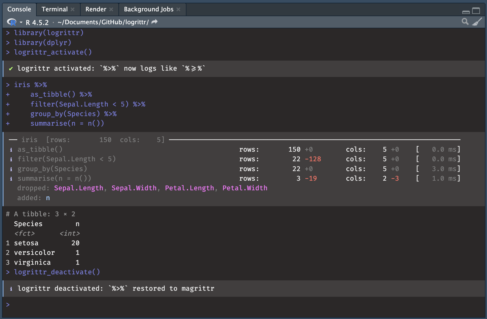
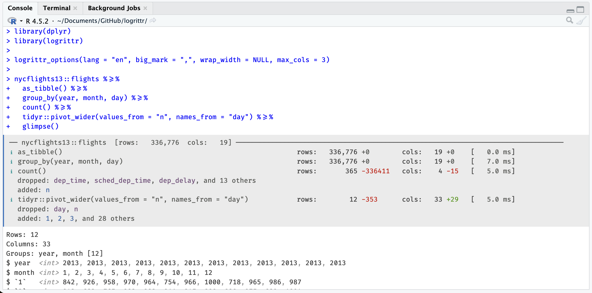

# logrittr 

> A logging pipe operator for dplyr and tidyverse data pipelines.

> `dplyr` verbs are descriptive: let's make them more verbose!


<br>
<hr>




## Motivation


In SAS, every DATA step prints a log:

```
NOTE: There were 120000 observations read from WORK.SALES.
NOTE: 7153 observations were deleted.
NOTE: The data set WORK.RESULT has 112847 observations and 11 variables.
```


R's `dplyr` pipelines are silent. `logrittr` fills that gap with `%>=%`, a
drop-in pipe that logs row counts, column counts, added/dropped columns, and
timing at every step, with no function masking.

With [Fira Code](https://github.com/tonsky/FiraCode) ligatures, `%>=%` renders
as a single wide arrow visually similar to `%>%` with an underline added, like a subtitle
or, say, to read between the lines of a pipeline.


## Multiples contexts

Things happens:

```
NOTE: There were 120000 observations read from WORK.SALES.
NOTE: 120000 observations were deleted.
NOTE: The data set WORK.RESULT has 0 observations and 11 variables.
```

#### Pro

Reading this a long time after execution of a script helps you see:

- what happened at which data step without the need of running code again
- keep trace of important workflows
- guarantee that you are able to explain what happened (auditing for instance)

In professional contexts it's often needed.

#### Educational

This will also make more sense with a logging output for people with few background in 
the tidyverse: first hours of code following a tutorial or learning alone.

## Installation

```r
install.packages('logrittr', repos = 'https://guillaumepressiat.r-universe.dev')

# or from github
# devtools::install_github("GuillaumePressiat/logrittr")
```

See https://guillaumepressiat.r-universe.dev/logrittr

## Usage


### With logrittr pipe

The simplest approach -- replace `%>%` or `|>` with `%>=%` where you want logging.

```r
library(logrittr)
library(dplyr)

iris %>=%
  as_tibble() %>=%
  filter(Sepal.Length < 5)  %>=%
  mutate(rn = row_number()) %>=%
  semi_join(
    iris %>% as_tibble() %>=%
      filter(Species == "setosa"),
    by = "Species"
  )  %>=%
  group_by(Species) %>=%
  summarise(n = n_distinct(rn))
```

```
── iris  [rows:       150  cols:    5] ─────────────────────────────────────────────────────
ℹ as_tibble()                            rows:       150 +0        cols:    5 +0    [   0.0 ms]
ℹ filter(Sepal.Length < 5)               rows:        22 -128      cols:    5 +0    [   3.0 ms]
ℹ mutate(rn = row_number())              rows:        22 +0        cols:    6 +1    [   1.0 ms]
  added: rn
ℹ > filter(Species == "setosa")          rows:        50 -100      cols:    5 +0    [   1.0 ms]
ℹ semi_join(iris %>% as_tibble() %>=%    rows:        20 -2        cols:    6 +0    [   5.0 ms]
  filter(Species == "setosa"), by =
  "Species")
ℹ group_by(Species)                      rows:        20 +0        cols:    6 +0    [   3.0 ms]
ℹ summarise(n = n_distinct(rn))          rows:         1 -19       cols:    2 -4    [   2.0 ms]
  dropped: Sepal.Length, Sepal.Width, Petal.Length, Petal.Width, rn
  added: n
```

### With magrittr pipe `%>%`

Replace `%>%` in the global environment with `%>=%` (and restore it) 
so existing pipelines are logged without any code change with activate / deactivate 
at the beginning and the end of a script / step.

```r
library(logrittr)
library(dplyr)

logrittr_activate()

iris %>%
  as_tibble() %>%
  filter(Sepal.Length < 5) %>%
  group_by(Species) %>%
  summarise(n = n())

logrittr_deactivate()
```

### In Rmarkdown or Quarto (hook)

```r
# In your setup chunk:
library(logrittr)

knitr::opts_chunk$set(
collapse  = TRUE,
comment   = "#>",
message   = TRUE   # needed to show logrittr output (uses message())
)

# For |> pipes (opt-in per chunk with logrittr = TRUE):
logrittr_hook()

Then in any chunk you want logged (native pipe):
#' ```{r, logrittr = TRUE}
iris |>
  as_tibble() |>
  filter(Sepal.Length < 5) |>
  group_by(Species) |>
  summarise(n = n())
#'```
```

### Screenshot




```r
library(dplyr)
library(logrittr)

logrittr_options(lang = "en", big_mark = ",", wrap_width = NULL, max_cols = 3)

nycflights13::flights %>=% 
  as_tibble() %>=%
  group_by(year, month, day) %>=% 
  count() %>=% 
  tidyr::pivot_wider(values_from = "n", names_from = "day") %>=% 
  glimpse()

```


## Options

```r
# Switch to French, comma as thousands separator, wider labels
logrittr_options(lang = "fr", big_mark = "\u00a0", wrap_width = 60)

# English
logrittr_options(lang = "en", big_mark = ",", wrap_width = 52)
```

| Option | Default | Description |
|---|---|---|
| `wrap_width` | `32` | Max chars before step label wraps |
| `big_mark` | `" "` (thin space) | Thousands separator |
| `lang` | `"en"` | Display language: `"fr"` or `"en"` |

## Why not `tidylog`?


[tidylog](https://github.com/elbersb/tidylog) is a really neat package that gives me motivation for this one.
`tidylog` works by masking dplyr functions which can cause subtle conflicts
with other packages. 

Anyway this also was a moment for me to test a new programmer tool that 
is used a lot for programming at this time.

`logrittr` uses a custom pipe operator and never touches
the dplyr namespace. Its console output is colorful and informative thanks to the cli package.

## Working with `lumberjack`

If you already know the [lumberjack](https://github.com/markvanderloo/lumberjack) package, 
compatibility is available with logrittr (timings are approximates).

Calling `logrittr_logger$new()`:

```r
library(lumberjack)
library(dplyr)

l <- logrittr_logger$new(verbose = TRUE)
logfile <- tempfile(fileext="r.log.csv")

iris %L>%
   start_log(log = l, label = "iris step") %L>%
   as_tibble() %L>%
   filter(Sepal.Length < 5) %L>%
   mutate(rn = row_number()) %L>%
   group_by(Species) %L>%
   summarise(n = n_distinct(rn)) %L>%
   dump_log(file=logfile, stop = FALSE)
   

mtcars %>% 
  start_log(log = l, label = "mtcars step") %L>%
   count() %L>%
   dump_log(file=logfile, stop = TRUE)


logdata <- read.csv(logfile)
```

Will write logrittr log content of multiple data steps in the same csv file.


## Limitations 

- Like `tidylog`, logrittr only works with dplyr pipelines on R data.frames (in memory)
and is not able to do so with dbplyr pipelines from databases (remote/lazy table).

- Join cardinalities nicely done in tidylog are difficult to have from the pipe 
as join is already done, at this time we only show N row and N col evolution (before / after). 

## Roadmap

This package at this time is a proof of concept and may not evolve much. It depends of feedbacks.

Good news: 

- Integration with the magrittr pipe `%>%` is now available via logrittr_activate (0.2.0)
- a knitr hook can also helps in iterative steps inside Rmarkdown or Quarto

Nevertheless, a to-do list:

- Join's cardinalities (get informations from before / after pipe) but it has drawbacks (slow)
- `loglevel` option to mute sub-pipeline steps

